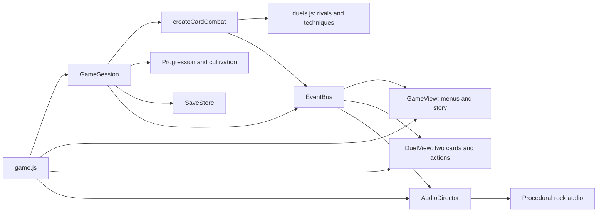

# Blades of the Four — card RPG architecture

## Current direction

The playable browser build is a turn-based wuxia RPG. The player confirmed one hero card versus one enemy card, with deliberate action choices. This replaces the previous real-time arena interaction. The four-act story, heroes, dialogue, Renown, cultivation, and checkpoint structure remain the campaign foundation. Act I is playable; Acts II–IV remain visibly gated.

## Runtime

The composition root injects `createCardCombat` into `GameSession`. The session owns campaign state, dialogue, encounter boundaries, rewards and persistence. Combat owns turns, rival intentions, damage, Flow, and victory/defeat signals. Neither domain module reads the DOM, a timer or browser storage.

| Module | Responsibility |
|---|---|
| `src/content/duels.js` | Act I card rosters, enemy stats/patterns, hero technique effects |
| `src/domain/card-combat.js` | One explicit action plus at most one enemy reply; no idle damage |
| `src/domain/session.js` | Scene transitions; injected combat factory; encounter preparation; upgrades and saves |
| `src/presentation/view.js` | Roster, dialogue, disciplines, pause, results, tea house; screen visibility and focus |
| `src/presentation/duel-view.js` | Two-card display, accessible meters, intent preview, action buttons, keyboard and short visual animations |
| `duel.css` | Responsive table, cards, action panel and reduced-motion behavior |
| `src/platform/save-store.js` | Versioned profiles, corruption checks, legacy migration, concurrent-tab protection |
| `src/platform/audio-director.js` | Story/battle cues routed to the existing procedural audio engine |
| `game.js` | Wiring, optional art loading and browser lifecycle; no simulation loop |

The old canvas renderer, real-time combat, input controller and fixed clock remain as archived modules with their existing regression coverage. The current browser root does not import or execute them. The session's default combat factory remains the legacy engine for compatibility; browser consumers must inject the card factory.

## Combat contract

Exactly two cards are on the table: the chosen hero and the current rival. Defeating a rival brings forward the next one, without giving that new rival a free attack. Act I has two swordsmen in encounter one, an archer and a swordsman in encounter two, then the Warden alone.

1. Inspect the rival's next move and its exact incoming damage.
2. Choose Strike, Guard, Technique or Healing tea.
3. Resolve the hero action. A defeated rival cannot retaliate.
4. If the rival survives, resolve its displayed reply exactly once, then reveal the next intention.
5. Repeat until the encounter ends. There is no timer, movement input, automatic attack, hit chance or damage while waiting.

| Action | Rule |
|---|---|
| Strike | Hero damage × run power. Gain 12 Flow plus discipline bonus. Rival guard halves normal damage. |
| Guard | Reduce this reply's damage by 80%, rounded to an integer. Gain 20 Flow. |
| Technique | Spend 40 Flow (30 with Still water). Use the selected hero's effect; pierce rival guard. |
| Healing tea | Once per encounter, recover up to 30 health. Rival still replies. Disabled at full health or with no tea. |

Zhao Yun deals double damage and halves the reply. Lu Zhishen deals 1.6× damage, restores 10 health and stuns the reply. Hu Sanniang deals 2.4× damage and restores 8 health. Lü Bu deals 2.8× damage. Techniques are disabled when unaffordable; invalid actions consume nothing.

Each defeated rival grants Renown, restores 12 health and grants 8 Flow. Disciplines apply between encounters, then restore 22 health and 20 Flow. The Warden increases outgoing damage by 20% after crossing half health, visible in the next intent preview. These are initial balance values, not final difficulty claims.

## Scene and presentation rules

- `menu`: roster visible and interactive; battle and modal hidden.
- `playing`: battle visible and interactive; roster and modal hidden. Rendering returns before any result-dialogue branch.
- `dialogue`, `paused`, `upgrade`, `waystation`, `victory`, `defeat`: battle beneath a populated modal, with background battle controls inert.
- Only explicit `victory` and `defeat` states create a result screen.
- Modal action buttons consistently target `modal-actions`, matching the shipped HTML.
- Button errors appear in an alert outside the hidden screens. Saved audio/motion settings apply on initial load.
- A brief visual animation disables repeat input, but cannot damage the player or change a turn. Reduced motion removes the animation.
- Keys 1–4 match the action buttons. Escape pauses/resumes. Held-key repeats are ignored.
- Missing artwork reports a retryable notice but cannot block a mechanically playable duel.

These rules address the previous empty menu overlay, missing action container, combat-to-defeat fallthrough, permanently hidden battle screen and stale inert states. Presentation regression tests use actual HTML IDs and an injected document adapter; browser checks cover real layout and clicks.

## Campaign and saves

`blades-profile-v2` continues to store settings, records, Renown wallet, cultivation ranks, unlocks, completed acts/runs and checkpoint. Existing saves are preserved. Checkpoints restart the current encounter or restore a dialogue, discipline choice or tea house; they do not restore mid-duel health, rival HP, intent or used tea. Old arena checkpoints enter the equivalent card encounter with saved starting stats. Optional `turns` defaults to zero on legacy saves.

Quick play allows all four heroes and updates personal records, but awards no permanent currency or unlocks. Campaign completes Act I through arrival dialogue, three encounters, two discipline choices, Warden dialogue, resolution, and tea-house cultivation. Reloading the tea house does not award victory twice. Cultivation applies on the next new campaign run. Lü Bu's campaign unlock still depends on the future Act III.

Writes continue to detect another tab's newer save, preserve corrupt/future-version data, and report session-only play when storage is unavailable. Browser QA uses a separate localhost origin so the user's normal 127.0.0.1 campaign progress is not replaced.

## Validation and scope

Run `npm test` and `npm run check` in `prototype/jade-gate`. Card tests cover idle safety, pause, exact replies, Flow affordability, guard, tea exhaustion, hero techniques, no post-defeat retaliation, all-hero completions, checkpoint recovery, cultivation, idempotent rewards and retry. UI tests cover the original screen/modal regressions. Existing legacy combat, save and audio tests remain.

Browser acceptance: roster → campaign dialogue → first card duel → disciplines → Warden stance change → resolution → tea house → purchase → reload/Continue; also pause/resume and Quick play. Check narrow layouts, card portraits, keyboard controls and reduced motion.

Delivered: local browser card RPG with Act I, four heroes, persistent progression, procedural soundtrack and 16 existing illustrated assets. Deferred: later acts, open-world exploration, equipment inventory, narrative branching, new card illustrations matching the revised weapon canon, 3D meshes/rigs and a Godot port.
