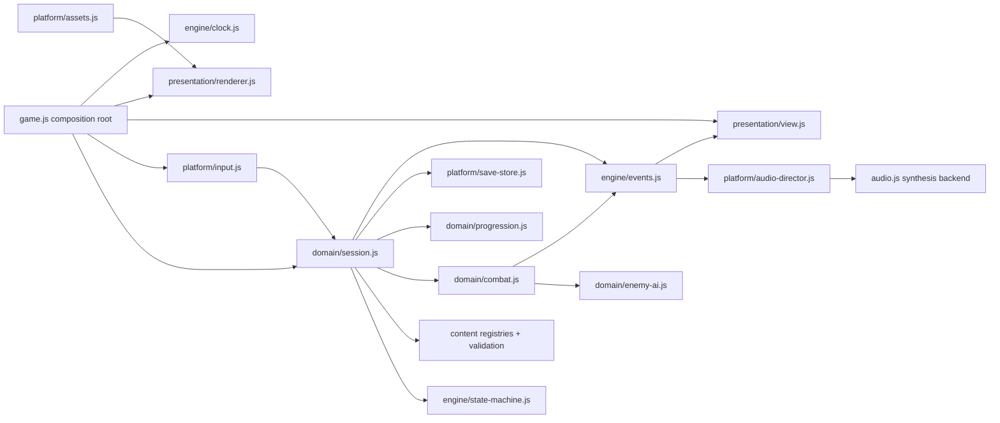
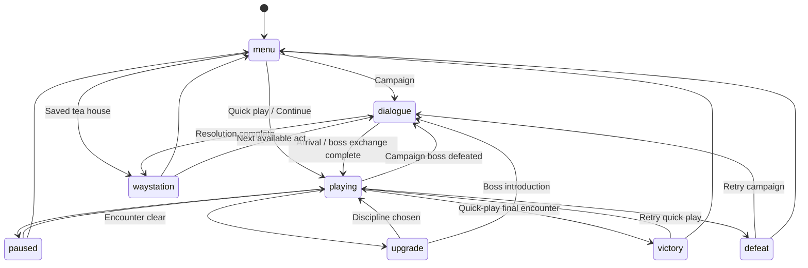

# Blades of the Four — architecture implementation

This document turns the updated `GAME-FLOW-AND-STORY-SPEC.md` into the browser game's executable foundation. Act I uses every current layer. Acts II–IV have validated campaign identities, dependencies, boss design metadata and an unlock contract; their levels and boss implementations are explicitly unavailable until built.

## Decisions that resolve the plan

- **Two modes:** Campaign follows narrative progression, checkpoints, Renown spending and the Act III Lü Bu unlock. Quick play exposes all four heroes without permanent bonuses or campaign rewards, preserving the original combat playground.
- **Canonical character data:** Zhao Yun uses the Qinggang Jian and Hu Sanniang is the Crimson Moon. Existing Zhao Yun imagery still depicts a spear; the portraits also do not consistently match the newly specified age of approximately 20. These are tracked art replacements, not reasons to change the new canon silently.
- **Save boundaries:** Continue restarts at the start of the current encounter, at a discipline choice, during a dialogue, or at the tea house. It does not restore live enemy positions or mid-swing physics. Quitting cannot duplicate a victory award.
- **Renown:** Quick-play records and campaign currency are separate. Campaign act victories credit a persistent wallet exactly once per run. Tea-house cultivation applies on the next campaign run and never changes quick-play balance.
- **Discipline versus cultivation:** The three between-encounter disciplines last for one run. Iron Vessel, Quiet Current and Honed Edge are permanent, capped upgrades purchased at the tea house. Honed Edge provides the first weapon-honing path.
- **Boss readability:** The Warden has a sweep phase and a below-half-health chain-thrust phase. Ordinary strikes cannot cancel armored windups; techniques can. Telegraphed impact geometry matches the rendered ellipse.
- **Evade contract:** A dodge grants 0.36 seconds of immunity. The first 0.12 seconds can award 10 Flow for a narrowly timed evade, once per attack. Damage immunity cannot farm evade rewards.
- **Campaign content gate:** The route shows Acts II–IV as “In development.” Availability is checked in the domain layer as well as the UI. No menu can launch an unbuilt boss.

## Dependency architecture

The domain modules do not read the DOM, localStorage, animation frames, Image, or AudioContext. Dependencies are injected at the composition root. The event bus has owned subscriptions and disposal. Content and state rules are tested through normal module imports; no tests rewrite production source strings or simulate a fake browser to reach hidden game functions.

## Runtime responsibilities

| Layer | Files | Responsibility |
|---|---|---|
| Composition | `game.js` | Builds services once, wires input and rendering, owns frame and page lifecycle |
| Engine | `src/engine/{events,state-machine,clock}.js` | Event delivery, legal scene transitions, 60 Hz fixed steps, bounded catch-up, seeded effects |
| Content | `src/content/{heroes,disciplines,campaign,dialogue,validate}.js` | Hero stats, four-act route, encounter rosters, boss phases, dialogue scripts, upgrade definitions, reference validation |
| Session | `src/domain/session.js` | Campaign/quick-play entry, encounter completion, dialogue continuation, checkpoint restoration and scene ownership |
| Combat | `src/domain/{combat,enemy-ai,encounters,player,math}.js` | Commands, damage, Flow, attack chains, evasion, AI, hit shapes and encounter construction |
| Progression | `src/domain/progression.js` | Renown accounting, idempotent run rewards, cultivation costs/caps and hero unlocks |
| Save adapter | `src/platform/save-store.js` | Versioned profiles, validation, migration, storage failure and concurrent-tab protection |
| Assets | `src/platform/assets.js` | Cached/deduplicated image loading; explicit errors and retry |
| Input | `src/platform/input.js` | Keyboard/pointer/touch mapped to commands; key release and lifecycle cleanup |
| Audio | `src/platform/audio-director.js`, `audio-schedule.js`, `audio.js` | Scene/event mapping, cue throttling, mixer persistence, synthesis, scheduling and disposal |
| Presentation | `src/presentation/{view,renderer}.js` | Menu/dialogue/tea-house UI, HUD and depth-sorted painted combat rendering |

## Scene contract

`GameSession` exclusively owns scene transitions. Combat emits `combat:cleared` and `combat:defeat`; it does not open a modal or access storage. Scene changes clear both platform input and buffered combat commands. Paused/dialogue/upgrade/tea-house scenes do not advance combat time.

## Commands and events

Commands: movement key state, `strike`, `dodge`, `technique`. Hit-stop buffers action presses up to eight commands; pause/menu transitions discard pending inputs. Future commands such as parry should be added to the input map and combat command dispatcher with their own timing tests.

| Event | Payload | Consumers |
|---|---|---|
| `state:changed` | previous/current scene, boss encounter flag | view, audio director, input/clock reset |
| `combat:hit` | enemy ID, damage | test/telemetry extension point |
| `combat:evade` | attack ID | audio director |
| `combat:cleared` / `combat:defeat` | none | session |
| `boss:phase` | boss ID, phase index, phase name | notice UI, audio director |
| `audio:sfx` | cue type, optional cue parameter | audio director |
| `notice` | text | view |
| `profile:changed` | none | menu/tea house/save warning UI |
| `settings:changed` | complete settings | audio director |
| `dialogue:changed` | none | view |

## Save schema and recovery

`blades-profile-v2` contains `version`, `settings`, `records`, `wallet`, `ranks`, `unlockedHeroes`, `completedActs`, a bounded `completedRuns` ledger, and `checkpoint`.

- Legacy `blades-records` best scores/wins migrate without granting campaign currency or Lü Bu unlocks.
- Version 1 structured profiles normalize to version 2.
- Numeric fields are finite, capped and nonnegative. Known IDs and checkpoint stages are whitelisted. Campaign unlocks derive from completed act definitions.
- Corrupt or newer-version saves are preserved and never silently overwritten. A visible notice explains why persistence is disabled.
- A failed storage write leaves the session playable and shows a session-only warning.
- Writes compare the current stored document with the last loaded/written document. If another tab has changed it, saving stops with a reload notice instead of overwriting newer progress.
- Save sanitization prevents malformed data from breaking the app; it is not an anti-cheat system.

## Audio improvements

The existing user's guzheng, pipa, xiao, tanggu, gong, bell, weapon and ambience synthesis is retained. These are procedural approximations of acoustic instruments, not recordings.

The director converts scene transitions and combat events into music/SFX calls. Sound/music toggles and independent master/music/effects levels persist with the profile. The scheduler uses AudioContext time, discards missed beats after mute/throttling, and caps work per tick. The director only unlocks/resumes a suspended context on a gesture; repeated movement keys do not restart the sequencer. Delayed cues are tracked and canceled when scenes change, the page hides, or audio is disposed. Hiding the page pauses combat and suspends audio.

## Extending the campaign

For Act II, supply a reviewed background and encounter roster, implement the Night Heron's telegraph/attack strategy in the domain AI, add arrival/boss/resolution dialogue, add the shallows/razor-wire environment system, and validate content before setting `available: true`. The same sequence applies to Act III's gusts and Lü Bu duel and Act IV's multi-form Sovereign. Domain availability gates deliberately prevent incomplete definitions from being treated as playable content.

To replace canvas presentation with Godot, retain the content IDs, combat/save/event contracts and scenario tests as a behavior specification. Port domain logic to GDScript/C#, replace platform adapters with Godot input/audio/resources/save APIs, then provide actual meshes and animation clips. This repository does not yet contain a Godot project or 3D implementation.

## Implemented versus deferred

Implemented: browser architecture, fixed-step combat, four quick-play heroes, Act I campaign, hero-specific Warden dialogue, two-phase Warden, perfect evades, cultivation/weapon honing, checkpoint saves, migration and recovery, art loading, audio mixer and lifecycle, tests and CI.

Deferred content/features: Acts II–IV maps and boss behaviors, environmental hazards, true parry action, elemental weapon effects, full inventory/equipment UI, voice acting, 3D meshes/rigs and Godot port. Their presence in the narrative bible is a production requirement, not evidence of shipped gameplay.

## Verification gates

`npm test` exercises combat, scene progression, purchases, rewards, checkpoint recovery, migration, malformed saves, concurrent tabs, asset retries, fixed-step determinism and audio scheduling. `npm run check` checks every JavaScript module and verifies the generated PNG assets. Browser checks cover campaign opening, combat/technique/pause, Continue after reload, audio preference retention, and the console.
