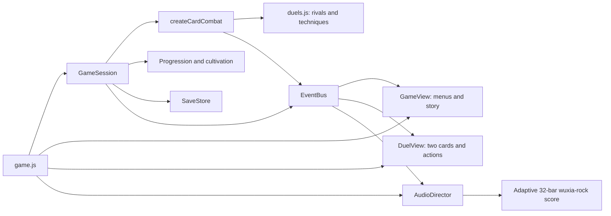

# Blades of the Four — card RPG architecture

## Current direction

The playable browser build is a wuxia RPG with two phases per encounter. The hero first roams an illustrated pass with button-driven movement while rivals patrol; walking into a rival starts a turn-based card duel of one hero card versus one enemy card, with deliberate action choices. The four-act story, heroes, dialogue, Renown, cultivation, and checkpoint structure remain the campaign foundation. Acts I–IV are playable: Act II has a shallows-slowed river pass and Night Heron duel; Act III has a cloud terrace, wind and falling-stone hazards, monk trial and Lü Bu rival duel. Act IV completes the story in the Imperial Meridian Citadel. Story protagonists are fixed to Zhao Yun, Lu Zhishen and Hu Sanniang; the other thirteen roster identities appear as named rivals. Quick Play retains the wider playable roster.

## Runtime

The optional `prototype/jade-gate/trailer.html` teaser is a standalone 10-second presentation linked from the game header. `src/content/trailer.js` owns the scene intervals, bilingual wording and narration cues. `trailer.js` renders from the shared Web Audio clock; `src/platform/trailer-audio.js` schedules a one-shot score, effects and bundled WAV narration. Pause suspends that clock, replay cancels old sources, and hidden tabs pause automatically. It reads the saved language preference but never writes campaign state. Existing game artwork supplies the montage, two-card clash and title screen. `TRAILER_CUTS` and `TRAILER_IMPACTS` now define narration close-ups, contact holds, scene cuts and the shared sound-effect times. `src/presentation/trailer-view.js` samples those cues to animate existing portraits, the reviewed Zhao Yun walking frames and duel poses, qi charge, blade trails and shock rings. Every visual uses the audio clock, including pause/replay; reduced motion disables zoom, travel and flashes. The score ducks beneath the bundled narration. `capscreens-trailer-motion/preview.html` reviews exact frames using the same renderer and the production trailer markup.

The composition root injects `createCardCombat` into `GameSession`. The session owns campaign state, dialogue, encounter boundaries, rewards and persistence. Combat owns turns, rival intentions, damage, Flow, and victory/defeat signals. Neither domain module reads the DOM, a timer or browser storage.

| Module | Responsibility |
|---|---|
| `src/content/duels.js` | Act I pass rosters, enemy stats/patterns, hero technique effects |
| `src/domain/roam.js` | Button-driven hero movement, deterministic rival patrols, contact hand-off; fixed 60 Hz step |
| `src/domain/card-combat.js` | One explicit action plus at most one enemy reply; one duel per contacted rival; no idle damage |
| `src/domain/session.js` | Scene transitions; injected combat factory; encounter preparation; upgrades and saves |
| `src/presentation/view.js` | Roster, dialogue, disciplines, pause, results, tea house; screen visibility and focus |
| `src/presentation/roam-view.js` | Pass scene, sprite placement, d-pad/WASD input, requestAnimationFrame stepping |
| `src/presentation/duel-view.js` | Two-card display, accessible meters, intent preview, action buttons, keyboard and short visual animations |
| `roam.css` | Pass stage, sprite scaling, d-pad buttons and touch behavior |
| `duel.css` | Responsive table, cards, action panel and reduced-motion behavior |
| `src/platform/save-store.js` | Versioned profiles, corruption checks, legacy migration, concurrent-tab protection |
| `src/platform/audio-director.js` | Story/battle cues routed to the existing procedural audio engine |
| `game.js` | Wiring, optional art loading and browser lifecycle; no simulation loop |

The old canvas renderer and real-time combat remain as archived modules with their existing regression coverage; the browser root does not import them. Roaming reuses the shared fixed-step clock for identical 30/120 FPS simulation, and the d-pad follows the archived input controller's pointer-capture pattern. The session's default combat factory remains the legacy engine for compatibility; browser consumers must inject the card factory.

## Combat contract

Campaign acts play as one Dynasty-Warriors-style open field: when the act begins, every encounter's rivals deploy at once on a single persistent map (`roam.js` open-field mode — roster + areas + anchors), areas running west → east with the act boss anchored in the far clearing. The map never resets between areas; the hero roams freely and may fight or slip past anyone. The hero and the rivals move with directional input, rivals patrol near their posts, and contact starts a duel with exactly two cards on the table — the chosen hero and the contacted rival. Each encounter splits into camps of at most two named legends — legends never pile up — each camp ringed by its own retinue (two or three guards per legend, `ESCORT_KINDS` rotating per camp); act grunts and tripled ranks stand apart in the encounter's grunt camp. When a legend falls, the camp's retinue routs (fresh tea and a roadside breather, +25 health / +10 Flow, with every rout) but a partner legend stands and fights to the last; the camp settles — and the nearby grunt camp routs with it — only when its last legend falls, granting the discipline choice. Leaderless grunt camps fall when their story cores fall. Act V (`otherworld`, the Hall of Twenty) fields nothing else: only the twenty hidden legends in ten camps plus Zhao Min's bridged camp — no rank grunts — and every act boss (Zhao Min included) now keeps a retinue that screens the approach, so the keeper cannot be reached by walking straight past the field. Elite areas still open their map offers (curio draft plus the spare-or-finish judgement); the branching map's travel nodes, roadside rests, travelers' events and shops no longer gate play (the shop and event machinery remains for future world touchpoints). Felling the act's biggest boss ends the act in victory regardless of grunts left standing; the boss bars the way with his intro dialogue on first contact. Checkpoints persist the cleared-area list. Areas that field a named legend rival also field an escort squad (`ESCORT_KINDS` in `duels.js` — three light guards per area, rotating by encounter): escorts deploy in a ring around the area's last named legend and screen her, cutting the line between hero and legend at intercept speed whenever the hero closes in. A standing hero is never shoved into a duel; the ward comes to blades only after her squad is cut down, and guards whose ward falls hold their ground as ordinary wandering rivals.
Quick Play fields a horde (`QUICKPLAY_HORDE` in `duels.js` — every encounter stands at twenty times its roster, e.g. 220 rivals across Act I) and the hidden twenty legends card up as playable leads and party members there (`setQuickplayHorde` dials the scale for classic-scale suites); Campaign keeps its story gate against them. The run still ends only in victory when every rival of the horde has fallen. Wander stages keep the classic per-encounter reset flow with no escorts and no open field.
1. Inspect the rival's next move and its exact incoming damage.
2. Choose Strike, Guard, Technique or Healing tea.
3. Resolve the hero action. A defeated rival cannot retaliate.
4. If the rival survives, resolve its displayed reply exactly once, then reveal the next intention.
5. Win the duel to return to the pass, then repeat until the field is clear. Inside a duel there is no timer, automatic attack, hit chance or damage while waiting; on the pass there is no combat damage — only contact matters.

| Action | Rule |
|---|---|
| Strike | Hero damage × run power. Gain 12 Flow plus discipline bonus. Rival guard halves normal damage. |
| Guard | Reduce this reply's damage by 80%, rounded to an integer. Gain 20 Flow. |
| Technique | Spend 40 Flow (30 with Still water). Use the selected hero's effect; pierce rival guard. |
| Healing tea | Once per encounter, recover up to 30 health. Rival still replies. Disabled at full health or with no tea. |

Zhao Yun deals double damage and halves the reply. Lu Zhishen deals 1.6× damage, restores 10 health and stuns the reply. Hu Sanniang deals 2.4× damage and restores 8 health. Lü Bu deals 2.8× damage. Techniques are disabled when unaffordable; invalid actions consume nothing.

Each defeated rival grants Renown, restores 12 health and grants 8 Flow. Disciplines apply between encounters, then restore 22 health and 20 Flow. The Warden increases outgoing damage by 20% after crossing half health, visible in the next intent preview. These are initial balance values, not final difficulty claims.

## Scene and presentation rules

- `menu`: roster visible and interactive; battle and modal hidden.
- `playing`: battle visible and interactive; roster and modal hidden. Rendering returns before any result-dialogue branch.
- `dialogue`, `paused`, `upgrade`, `waystation`, `victory`, `defeat`: battle beneath a populated modal, with background battle controls inert.
- Only explicit `victory` and `defeat` states create a result screen.
- Modal action buttons consistently target `modal-actions`, matching the shipped HTML.
- Button errors appear in an alert outside the hidden screens. Saved audio/motion settings apply on initial load.
- A brief visual animation disables repeat input, but cannot damage the player or change a turn. Reduced motion removes the animation.
- Keys 1–4 match the action buttons. Escape pauses/resumes. Held-key repeats are ignored.
- Missing artwork reports a retryable notice but cannot block a mechanically playable duel.

These rules address the previous empty menu overlay, missing action container, combat-to-defeat fallthrough, permanently hidden battle screen and stale inert states. Presentation regression tests use actual HTML IDs and an injected document adapter; browser checks cover real layout and clicks.

## Campaign and saves

`blades-profile-v2` continues to store settings, records, Renown wallet, cultivation ranks, unlocks, completed acts/runs and checkpoint. Existing saves are preserved. Checkpoints restart the current encounter or restore a dialogue, discipline choice or tea house; they do not restore mid-duel health, rival HP, intent or used tea. Old arena checkpoints enter the equivalent card encounter with saved starting stats. Optional `turns` defaults to zero on legacy saves.

The roster is nine heroes: the original four plus Guan Yu, Wu Song, Mu Guiying, Liang Hongyu and Nie Yinniang from the 2026-09-25 Stitch try-run (full-body portraits and transparent gameplay sprites; initially available in Quick Play, then unlocked in Campaign at story milestones). Quick play allows every hero and updates personal records, but awards no permanent currency or unlocks. The last party of exactly three (`profile.lastQuickParty`: `{ lead, followers }` of two cosmetic followers) is stored on that same profile and preselected the next time Quick Play opens. It does not change act unlocks. Campaign completes Act I through arrival dialogue, a branching pass map (ambush / elite / event / rest / duel rows; single-node rows auto-march), a discipline after every fight, Warden dialogue, resolution, and tea-house cultivation. Elite victories and event boxes draft run-scoped curios (`curios.js`) that bend duel rules; picks are checkpointed with the map. The pass feeds the duel: first blood and sneak contacts open with the rival reeling (`roam.js` marks first blood; `sneak` halves speed and archer aggro). The tea house trades Renown on a meridian map (`meridians.js`): three vessels of gated points plus three crossing-cavity perks, with legacy cultivation ranks migrated. The expansion systems live in `expansion.js`: hero signature actions (a fifth Flow-gated duel move), rival focus/special attacks (techniques break the gathering), oath-bonded party assists, run-seeded weather, composure attrition on the pass, the pass merchant (run-renown shop), the elite spare-or-finish judgement with sect reputation and the Venom Adept recruit, the codex, and the endless Jianghu Wander. The rival pool carries status intents — bleed (ignores guard), poison (tea-cleansed), Flow siphon, hero-stunning concussion, twin strikes and self-mending — resolved from data-driven intent specs in `card-combat.js`; status chips render under each health bar. Reloading the tea house does not award victory twice. Cultivation applies on the next new campaign run. Lü Bu unlocks when the playable Act III rival duel is cleared.

Writes continue to detect another tab's newer save, preserve corrupt/future-version data, and report session-only play when storage is unavailable. Browser QA uses a separate localhost origin so the user's normal 127.0.0.1 campaign progress is not replaced.

## Validation and scope

Run `npm test` and `npm run check` in `prototype/jade-gate`. Card tests cover idle safety, pause, exact replies, Flow affordability, guard, tea exhaustion, hero techniques, no post-defeat retaliation, all-hero completions, checkpoint recovery, cultivation, idempotent rewards and retry. UI tests cover the original screen/modal regressions. Existing legacy combat, save and audio tests remain.

Browser acceptance: roster → campaign dialogue → the pass (move by buttons and WASD) → contact starts first card duel → win returns to the pass → disciplines → Warden stance change → resolution → tea house → purchase → reload/Continue; also pause/resume from both the pass and a duel, and Quick play. Check narrow layouts, pass sprites, card portraits, keyboard controls and reduced motion.

Delivered: browser card RPG with Acts I–III, twelve heroes, persistent progression, four new Act II/III procedural themes and 40 illustrated assets. Deferred: Act IV, open-world exploration, equipment inventory, 3D meshes/rigs and a Godot port. Sun Shangxiang, Gu Dasao, and Qin Liangyu are Quick Play only.

### Localization and roster availability (26 September 2026)

`HEROES[].quickPlayOnly` keeps newer heroes in Quick Play until earned, except Sun Shangxiang, Gu Dasao, and Qin Liangyu, who stay Quick Play only. The menu reveals earned heroes in Campaign in story order: Guan Yu after Act I, Wu Song after Act II, and Mu Guiying, Liang Hongyu and Nie Yinniang after the three mountain encounters. Session validation checks earned milestones rather than trusting the visible roster list. Save normalization preserves records and currency while discarding checkpoints for unavailable heroes. Lü Bu unlocks after the Act III rival duel. Quick Play's chapter selector can launch any of the three built acts for immediate testing without changing campaign progress.

Dialogue scenes dress the speaker: their portrait card (`#dialogue-portrait`, framed art plus a name caption, resolved by `portraitFor` in `platform/speech.js` from hero/rival display names, narrators borrow the player hero) stands beside the words. Each line is also read aloud through the browser's speechSynthesis — female-first voices ranked per language (`scoreVoice`/`pickVoice`), one stable voice per speaker with a per-speaker pitch shift, gated by the Sound toggle and cancelled when the scene ends or the sound goes off.

`profile.settings.language` is `ja` by default or `en` by explicit selection. `src/locales/i18n.js` applies source-key translations to dynamic text and `data-i18n` attributes to static markup. `ja-content.js` contains every biography and story exchange. Language changes rerender current scenes without advancing dialogue or committing a pending combat turn.

The header settings/links and exploration controls/map each use a native disclosure, closed on page load. Their localized summary buttons toggle the panels by click, Enter or Space. Exploration preserves native summary activation while keeping other gameplay hotkeys available; the header panel sits above scene content and beneath modal dialogs.

Card cinematics use each hero’s transparent sprite and individual CSS strike styles. Damage remains committed once at timeline completion. `COUNTER_CUTS` declares rival strike and special beats relative to `reply`: ordinary counters dash then land; specials add a 900ms `counter-focus` charge before the strike and a 650ms impact hold. `rivalFilmIdentity(enemy)` returns `{style, color, seal, special}` independently of the player's hero. The right-side close-up, localized technique title, weapon motion, emblem and charge/special sounds follow that identity; guard holds the block pose instead of reeling. Approved enemy pose atlases follow wind-up → focus → special; bosses retain costume-specific sprites when matching action art is unavailable. Close-ups size actors by film height and adjust their horizontal framing on narrow screens to keep faces clear of the emblem. Cancellation clears poses/art and invalidates all pending beats. Reduced motion and no-incoming replies keep the legacy single reply beat. The persisted reduced-motion preference controls animation; OS preference initializes it only before the player has saved settings.

### Act II and III materials and music (27 September 2026)

Act II uses the latest `bamboo-roam.png` for card duels, `shadow-assassin-sprite.png`, `skiff-archer-sprite.png`, and `night-heron-sprite.png`. Act III uses `mount-canglan.png`, `canglan-monk-sprite.png`, and `lu-bu-rival-sprite.png`. The cursed Lü Bu sprite preserves the existing hero identity. All are listed in the asset manifest and gallery. The duel film receives the current act arena image; exploration selects its separate ground plate from `roam-scenes.js`. `music-score.js` contains distinct 32-bar bamboo, Heron, Canglan, and Lü Bu themes, selected from act and boss state by `audio-director.js`.

`profile.earnedHeroes` stores the three mid-Act III rescues. The save sanitizer derives Guan Yu and Wu Song from completed acts and Lü Bu from completed Act III, so old saves gain those rewards without interpreting old Quick Play records as unlocks. Wind affects actors and arrows on the ground; falling pillars telegraph a target circle before damage and respect dodge invulnerability.

### Restored scenes and route overview (1 October 2026)

This merge builds on `b081de3` and keeps the newer party assist, swap cues, fifteen-character roster and south clearing. `ground.js` defines a 10,240 × 1,440 world: four forest stretches, the original west choke point, the connected south spur and four alternating east passages. Ordinary encounters retain their near/corridor/pocket posts; the Act I Warden occupies `far-clearing`. Domain tests walk the entire route with a party and verify every step against walls and ground bounds.

The scene data shape is `{ art, blocker, tileWidth, artHeight, topCrop }`, keyed by act ID in `src/content/roam-scenes.js`. Exploration uses `bamboo-maze-natural`, `bamboo-crossing-ground`, or `canglan-terrace-ground`. Stage II's new plate derives from the latest bamboo landscape; Stage III's new plate keeps clouds outside the central stone floor. Camera scale remains constant while panning. `blocker-art.js` samples square cutouts along every collider, including horizontal spur walls, rather than stretching images into rectangles. Stage III crops the source's lower rock detail through CSS; separate rock generation was unavailable, so no missing asset is referenced.

`route-map.js` consumes a read-only snapshot of normalized ground, walls, camera, hero, followers and remaining rivals. Its collapsible Japanese/English UI never changes movement, saves or combat; defeated enemies leave the map. Zhao Yun and Hu Sanniang sheets have `runtimeApproved: false`: the loader uses their original clean sprites and a reduced-motion-aware walking bob. Existing sheet files are preserved for a later reviewed replacement. Lu Zhishen's approved animation and idle freeze are retained.

Generated scene prompts are saved under `prototype/jade-gate/prompts/`, with provenance in the asset manifest. The scene merge regression suite covers the complete Warden route, per-act image loading and camera scale, map updates without domain mutation, and clean character fallback.

### Story rivals and expansion artwork (1 October 2026)

Latest base: `f831ae8`. The user changed the Story role contract: only the first three roster heroes may start or resume Campaign. `story-rivals.js` declares `STORY_HERO_IDS`, rival identity records `{heroId, name, title, art, portrait, hp, damage, reward, pattern}`, and Story encounter rosters. `rosterForEncounter(id, runMode)` is the single selector used by roaming and card combat; Quick Play and Wander retain their original encounter lists. Named rivals cover all thirteen other identities across four acts, including the existing Lü Bu boss and Venom Adept. Original heroes never appear as opposing hero rivals. Story completion no longer recruits another protagonist; old completion, record, currency and rescue data are retained but cannot override the role policy. Checkpoint continuation rejects a rival hero and the menu hides that unavailable Continue route.

Artwork follows `prototype/jade-gate/docs/ASSET-REQUIREMENTS.md`: native PNGs, true alpha for sprites/overlays, and fixed filenames. `expansion-art.js` selects signature icons and special telegraphs; hero rivals use their corresponding signature emblem, while the eleven generic special motifs serve their original rival kinds. Focus-ready art appears on the enemy card where focus resolves. Oath IDs bind generated emblems to party/assist HUDs. Weather overlays are translucent and pointer-inert, and the merchant displays its portrait. Act IV uses its own imperial marble ground/duel plate and dedicated Sentinel and Acolyte sprites; the Sovereign retains its existing Warden fallback. Eight required images were generated and the user deferred the remaining 28 after service failures. `ASSET-GENERATION-STATUS.md` records their exact filenames. The asset manifest records prompts and minimum dimension/alpha contracts; optional presentation artwork absent from the manifest remains hidden rather than showing a broken image.

Validation includes a shared-roster contact/duel test, every non-protagonist identity on Story nodes, all three protagonists completing four acts with earned tea-house cultivation, legacy role/save protections, and existing Quick Play and expansion mechanics. Prompts are saved under `prototype/jade-gate/prompts/expansion-assets.json` and `venom-adept*.txt`.

### Card-only body poses (1 October 2026)

A hero can declare `cinematicArt` as a reviewed transparent still-image path independently of its opaque gallery `keyArt`. Zhao Min uses her user-generated full-body ready sprite for opening, guard and reduced-motion shots; action poses resolve separately through the atlas and optional file overrides. This override also resolves by the story rival's art identity.

Selection portraits and static duel cards resolve through `src/presentation/character-art.js`, which returns `{ src, fit, position }`. `keyArtFocus` controls the selection crop for off-center landscape portraits without shifting gameplay bodies. Static duel cards and dialogue use `cinematicArt` with centered `contain` placement when supplied; otherwise they resolve the actual `keyArt` filename or the legacy PNG portrait. This avoids requesting nonexistent `<id>.png` portraits for the JPEG-based hidden roster.

An atlas can also declare partial `poseFiles` keyed by `windup`, `strike`, `focus` or `special`. Each path must reference a runtime-approved square-alpha manifest asset. The renderer displays these native single-frame PNGs without atlas cropping, then returns to the existing atlas for other poses. As of 4 October, all 92 single poses supplied in PR #106 are mapped for the 20 hidden heroes plus Gu Dasao, Qin Liangyu and Bao Sanniang. Their `cinematicArt` paths select transparent ready sprites, including story rivals resolved by art identity. The asset check rejects approved pose PNGs that are absent from combat mappings.

`src/platform/duel-poses.js` resolves an approved `<fighter-id>-duel-poses` atlas with four named cells: `windup`, `strike`, `focus`, `special`. Existing reviewed sheets can declare the same cells explicitly (Lu Zhishen). Hero attacks and rival replies switch pose at cinematic beats and hold contact artwork through impact. Assists use the follower’s own atlas. Cancellation clears both sides; reduced motion uses stills and the existing short timing. Combat still commits once at the original timeline completion. Walking sheets remain independent. Signatures share their hero’s technique choreography.

Generation failed for Zhao Yun and Hu Sanniang; the user deferred further generation. No new pose PNGs are claimed. Lu Zhishen’s existing frames are wired; the other fifteen heroes continue with their existing sprites until the pending art is delivered. See `prototype/jade-gate/docs/DUEL-ACTION-ASSETS.md` for statuses and prompts.
