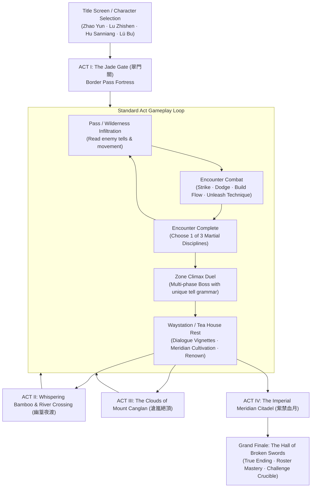
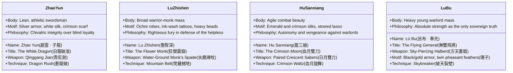
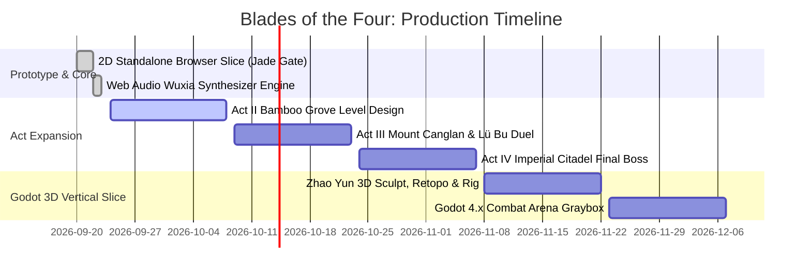

# Blades of the Four: Master Game Flow & Narrative Bible

**Document Version:** 1.0.0  
**Project:** Blades of the Four (四俠傳 · 翠門關)  
**Target Platform:** PC / Browser / Godot Engine Target  
**Audience Target:** Adult (20–30) martial arts and combat fantasy enthusiasts  
**Creative Pillars:** Combat-First Readability · Grounded Classical Legends · Dynamic Flow Economy · Adult Wuxia Elegance

---

## Combat direction update — 2026-09-24

The player has confirmed a **hybrid loop: roam, then duel**. Between fights the hero walks the pass with on-screen buttons or WASD/arrow keys while rivals patrol; meeting a rival starts a **turn-based card duel: one hero card versus one enemy card** with visible enemy intentions and Strike, Guard, Technique and Healing tea actions. There is no dodge timing, real-time combat damage, or automatic damage inside duels. The story and cultivation below remain the narrative foundation; older real-time combat details are historical production concepts superseded by [the current architecture](GAME-ARCHITECTURE.md).

## Implementation status and architecture

The executable foundation is documented in [GAME-ARCHITECTURE.md](GAME-ARCHITECTURE.md). Campaign mode now plays through Acts I–IV with arrival dialogue, encounter disciplines, multi-phase bosses, resolution dialogue, tea-house cultivation and checkpoint continuation. Story heroes are Zhao Yun, Lu Zhishen and Hu Sanniang. All other roster identities oppose them as named rivals on the pass; defeating or sparing them does not add a Story protagonist. Quick Play retains the full wider roster, with the Venom Adept earned through an elite judgement.

Acts I–IV are now playable in the browser; deeper parrying and 3D assets below remain production targets. The timeline is a planning estimate, not a delivery guarantee. Existing character art also requires a canon-alignment pass, especially Zhao Yun's sword and the revised ages.

## 1. Executive Summary & Creative Vision

*Blades of the Four* is a combat-first, single-player wuxia action RPG. Set in an era of dynastic collapse, four legendary martial figures—each reimagined in their sharp, dangerous early twenties—are drawn into a collision course against the **Ashen Banner (灰旗會)**, an autocratic martial syndicate that seeks to subjugate the jianghu by capturing the empire's strategic mountain passes.

### Core Narrative Premise
> *"An empire can crumble in a night, but an oath carved in steel outlives dynasties."*  
> (山河有盡，寸刃不移。)

The story rejects romanticized cute idol tropes and grim nihilism in favor of classic, razor-sharp wuxia: honorable outcasts, clash of martial philosophies, blood on stone, and high-speed lethal weapon mastery.

---

## 2. Macro Game Flow Architecture



### The Progression Loop: Micro to Meta

1. **In-Combat Micro Loop (The Combat Contract)**:
   - **Read & Anticipate:** Enemy telegraphs show pale wind-up -> blood-red warning circle -> lethal impact.
   - **Evade / Parry:** Dodge grants a 0.36s invulnerable afterimage window without stamina constraints (governed by a tight cooldown).
   - **Chain Attacks:** 3-hit weapon chain with crisp hit-stops and damage multipliers on the finisher.
   - **Qi Accumulation (Flow):** Clean hits and last-second dodges build Flow (0 to 100).
   - **Technique Unleash:** Spend Flow (30–40) to execute signature crowd-clearing or guard-breaking arts.

2. **Mid-Run Loop (The Discipline Choice)**:
   - Between encounter waves, choose one of three martial disciplines (e.g., *Tempered Steel* [+25% damage], *Mountain Heart* [+Max HP & Heal], *Still Water* [Flow generation & discount]).
   - Restores 22 HP and 20 Flow, allowing players to recalibrate their survival strategy.

3. **Macro Campaign Loop (The Journey Across Jianghu)**:
   - Completing an Act unlocks the **Tea House Waystation (草庵茶肆)**:
     - **Dialogue Vignettes:** Brief, high-impact in-engine conversations revealing character pasts and world lore.
     - **Meridian Vessel Cultivation (經脈修煉):** Spend Renown earned from high combos and clean victories to unlock permanent passive edges (e.g., Extended Parry Window, Quick-Recovery Flow Retention).
     - **Weapon Honing (兵刃淬火):** Refine elemental sparks, reach extensions, and kinetic knockbacks.

---

## 3. The Four Legends: Identities & Character Arcs

All four heroes are locked at approximately **20 years old**—young adults at the height of physical agility and raw martial conviction.



### Detailed Character Profiles

#### 1. Zhao Yun (趙雲 · 子龍) — The White Dragon
- **Historical Grounding:** General of Shu Han; known for unmatched spear and sword mastery at Changban.
- **In-Game Concept:** A wandering young swordsman who carries the legendary *Qinggang Jian*. He has left behind corrupted warlords who treated soldiers as fodder.
- **Narrative Arc:** Zhao Yun seeks a lord or a cause worthy of blood. At the Jade Gate, he realizes that true *Xia* (俠) does not serve thrones—it protects the border gates through which innocent refugees flee.
- **Signature Combat Dynamic:** Forward dash piercing thrusts, rapid recovery, exceptional linear crowd control.

#### 2. Lu Zhishen (魯智深) — The Flower Monk
- **Historical Grounding:** Hero of Mount Liang (*Water Margin*); former garrison officer who became an outlaw monk.
- **In-Game Concept:** A 20-year-old warrior-monk whose body bears fierce peony tattoos. Expelled from Mount Wutai for breaking temple gates in pursuit of corrupt tyrants.
- **Narrative Arc:** Lu Zhishen battles his inner tempest. When the Ashen Banner burns Buddhist shrines along the pass, his monk spade becomes both a weapon of wrath and an instrument of mercy.
- **Signature Combat Dynamic:** Heavy sweeping arcs, long stun durations, ground-shattering poise breaks that interrupt armored boss tells.

#### 3. Hu Sanniang (扈三娘) — The Crimson Moon
- **Historical Grounding:** Peerless warrior of the Hu Family Manor (*Water Margin*).
- **In-Game Concept:** High-born daughter of a fallen martial manor slaughtered by Ashen Banner conspirators. She wields twin sabers with lethal elegance, wearing battle silks of crimson and jade.
- **Narrative Arc:** Hu Sanniang refuses to be a prize, an ornament, or a hostage. Her quest is ruthless retribution against the imperial traitors who orchestrated her clan's fall. Along the journey, she discovers comradeship she never expected among her fellow blades.
- **Signature Combat Dynamic:** Fastest movement speed and shortest attack recovery; relentless multi-hit combos and evasive repositioning.

#### 4. Lü Bu (呂布 · 奉先) — The Rival / The Sky-Splitter
- **Historical Grounding:** The supreme warrior of the Three Kingdoms era, feared for his halberd and volatile loyalties.
- **In-Game Concept:** A ferocious young warlord whose twin pheasant feathers (*Lingzi*) dominate the battlefield horizon. He has initially allied with the Ashen Banner not out of loyalty, but because they promised him the only worthy duel in the realm.
- **Narrative Arc:** Serves as the primary rival and Act III boss. Through a climactic duel atop Mount Canglan, the player shatters his illusion of solitary dominion. Upon defeat, his Ashen Oath breaks. He remains a Story rival and is playable in Quick Play.
- **Signature Combat Dynamic:** Massive reach, devastating individual hit damage, wide cleaving hitboxes that dominate the arena.

---

## 4. The Campaign Narrative: Act by Act

```mermaid
sequenceDiagram
    autonumber
    actor Player as Chosen Hero
    actor Guard as Ashen Warden
    actor LuBu as Lü Bu (Rival)
    actor Sovereign as Ashen Sovereign

    Note over Player,Guard: ACT I: THE JADE GATE
    Player->>Guard: Breach border fortifications & silence archers
    Guard->>Player: "The Banner will cleanse this decaying world!"
    Player->>Guard: Defeats Warden; reclaims Jade Gate
    Guard-->>Player: Dies revealing the Meridian plot

    Note over Player,LuBu: ACT II & III: THE CLOUD MONASTERY
    Player->>Player: Infiltrates Mount Canglan
    LuBu->>Player: "Prove your steel can touch my feathers!"
    Player->>LuBu: Climactic Duel on the Precipice
    Player->>LuBu: Breaks the Ashen Seal over Lü Bu's halberd
    LuBu-->>Player: "We ride for the Capital together."

    Note over Player,Sovereign: ACT IV: THE IMPERIAL CITADEL
    Player->>Sovereign: Storms the Hall of Broken Swords
    Sovereign->>Player: Unleashes corrupted Five-Gate Qi
    Player->>Sovereign: Unbroken Oath Strike (Four Blades Resonance)
    Sovereign-->>Player: Sovereign falls; the realm breathes free
```

### Detailed Act Breakdown

### Act I: The Jade Gate (翠門關) — *Current Playable Prototype*
- **Theme:** Reclamation of the Frontier.
- **Atmosphere:** Desolate autumn winds, yellow dust, blood-soaked jade courtyard paving stones.
- **Encounter 1 — The Vanguard:** Five Ashen guards testing basic cadence, dodging, and light attack chains.
- **Encounter 2 — The Crossfire:** Seven mixed guards and perimeter archers with linear sightline telegraphs.
- **Encounter 3 — The Ashen Warden (崔玄):** 
  - *Boss Persona:* A former imperial border captain who drank the Ashen Qi Elixir to gain dark vitality.
  - *Phase 1:* Heavy polearm sweeps with large telegraph circles.
  - *Phase 2 (Below 50% HP):* Enraged red flashes, continuous forward thrusts requiring technique interrupts.
- **Story Resolution:** The Warden falls with a cryptic warning: *"The Jade Gate was only the threshold... the Sovereign already walks the capital."*

### Act II: Whispering Bamboo & The River Crossing (幽篁夜渡)
- **Theme:** Ambush, Night Rain, and Guerilla Blade-craft.
- **Atmosphere:** Raindrops drumming on bamboo leaves, water reflections, lantern glow in thick fog.
- **Mechanics:** 
  - Water shallows that slightly impede movement.
  - Ashen Shadow Assassins that cloak and strike with rapid lunges.
  - River skiff archers firing volleys across the riverbank.
- **Boss Duel — The Night Heron (夜鷺娘子):** 
  - A blind zither-assassin perched upon a stone pagoda. Uses musical sonic shockwaves (soundwaves telegraphed as rippling concentric arcs) and razor-wire traps.

### Act III: The Clouds of Mount Canglan (滄嵐絕頂)
- **Theme:** Altitude, Honor, and Martial Rivalry.
- **Atmosphere:** Towering cliffside stone platforms, swirling mist, thunderous temple bells echoing across the gorge.
- **Mechanics:** Wind gusts affecting trajectory, falling stone pillars, armored elite monks.
- **Boss Duel — Lü Bu (呂布 · 奉先):**
  - *The Feathers of the Flying General:* Lü Bu moves with sudden, explosive lunges. His halberd covers half the screen.
  - *Climactic Duel:* A true test of dodging timing and Flow economy. Defeating him breaks the cursed Ashen Oath, turning him from an enemy into an ally.

### Act IV: The Imperial Meridian Citadel (紫禁血月)
- **Theme:** Dynasty's Twilight and Ultimate Convergence.
- **Atmosphere:** Palace courtyards illuminated by an eerie crimson eclipse; imperial banners torn in half.
- **Final Boss — The Ashen Sovereign (灰旗宗主 · 墨幽):**
  - Three distinct phases:
    1. *The Five Elemental Forms:* Seamlessly shifts between Spear, Dual Blades, Spade, and Halberd stances.
    2. *The Meridian Tempest:* Floods the arena with corrupted Qi vortexes.
    3. *Desperate Duel:* Blindingly fast duel where only perfect parries/evades grant opening for Flow techniques.
- **Epilogue:** The three protagonists stand on the palace parapet as dawn breaks over the mountain pass. The empire has fallen, but the wandering spirit of the jianghu endures.

---

## 5. In-Engine Script & Dialogue Vignettes

### Act I Boss Encounter Script: The Ashen Warden

#### Pre-Battle Exchange (Hero Specific)

**When Playing Zhao Yun:**
> **Ashen Warden:** *"A young swordsman from Changshan... Why bleed for an empire that has already forgotten its gates?"*  
> **Zhao Yun:** *"I do not bleed for the empire. I bleed so the people behind this gate can sleep without terror. Draw your blade."*

**When Playing Lu Zhishen:**
> **Ashen Warden:** *"A renegade monk with blood on his prayer beads. Is this your Buddhist compassion?"*  
> **Lu Zhishen:** *"Buddha shows mercy to souls. My monk's spade is reserved for devils like you!"*

**When Playing Hu Sanniang:**
> **Ashen Warden:** *"The orphan of the Hu Manor... You should have stayed hidden in the tea hills, girl."*  
> **Hu Sanniang:** *"My father's blood still stains the banner behind you. Today, my sabers wash it clean."*

**When Playing Lü Bu:**
> **Ashen Warden:** *"General Lü! You swore an accord with the Sovereign—why strike down our own garrison?!"*  
> **Lü Bu:** *"Your Warden blocks my path and dares speak of accords. Stand aside, or be split beneath my halberd."*

---

## 6. Procedural Wuxia Audio Architecture

Implemented in `prototype/jade-gate/audio.js`:

| Instrument / SFX | Acoustic Synthesis Method | Aesthetic Role in Wuxia Palette |
|---|---|---|
| **Guzheng (古箏)** | Plucked string model (filtered sawtooth + exponential dampening + finger vibrato) | Melodic melancholy on menu & victory; solitary wanderer tone |
| **Pipa (琵琶)** | Fast bandpass transient plucks with bright high-frequency bite | Rapid combat ostinatos, simulating martial tension and flying blades |
| **Xiao Flute (簫/笛)** | Sine core + breath bandpass noise + portamento pitch glide | Atmospheric mountain pass wind, poignant martial resolve |
| **Tanggu (堂鼓)** | Pitch-sweep kick (165Hz → 48Hz) + resonant shell noise | Driving military rhythm, syncopated war drum march |
| **Luo Gong (銅鑼)** | Inharmonic additive modal frequencies with pitch-bend droop | Battle start, boss phase transition, triumphant conclusion |
| **Temple Bell (梵鐘)** | Multi-partial bronze resonance (1.0, 1.41, 1.73, 2.3, 2.9) | Lu Zhishen signature, combo finishers, defeat dirge |
| **Blade Strike (劍鳴)** | High-velocity air turbulence noise + metal ring | Sharp cutting tactile feedback on light attack |
| **Ethereal Dodge (凌波)** | Swept lowpass pink noise with resonant frequency dive | Wuxia light-footwork (*Qinggong*) sensation |

---

## 7. Roadmap & Next Production Milestones



---
*End of Game Flow & Story Specification.*

### Playable unlock bridge

The Warden's fall brings Guan Yu to guard the reclaimed gate. After the Night Heron falls, Wu Song frees the river boats and joins. On Mount Canglan, Mu Guiying is reunited with her trapped scouts after the cloud-road fight; Liang Hongyu answers the temple bell after either second-row route; Nie Yinniang severs the hidden threads of the Ashen Oath after the cloister patrol. The final duel frees Lü Bu and makes him a campaign ally. These rewards persist, including across a mid-act checkpoint reload.
